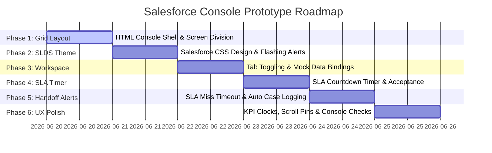

# Phasewise Implementation Plan - Salesforce Service Console Prototype (OOW)

This document details the step-by-step development strategy for the **Salesforce Service Console Out-of-Warranty (OOW) Prototype**. It outlines files, styling systems, client-side states, SLA mechanisms, and testing metrics.

---

## 🛠️ Tech Stack & File Structure
To keep this prototype clean, lightweight, and isolated from the previous customer-facing assistant page, we will create a dedicated set of Salesforce-themed console files:
* **HTML5**: Service Console layout based on the Salesforce Lightning Grid.
* **CSS3**: Salesforce Lightning Design System (SLDS) aesthetics (standard borders, slate backgrounds, font structures, badges).
* **Vanilla JavaScript**: Console state controller, SLA countdown timer, dynamic tab reloaders.

### Proposed Directory Layout:
```text
DellChatbotMVP/
├── console.html                  # Salesforce Console layout and tab structure
├── console.css                   # SLDS styling, split layout, and flashing keyframes
├── console.js                    # Session state, AHT timer, SLA manager, logs
├── Dell_Logo.svg.png             # Brand assets
└── docs/
    ├── problemstatement1.md      # Console specification details
    └── phasewiseimplementation1.md # This document
```

---

## 📅 Implementation Phases



### 🧱 Phase 1: Console Shell & Grid Layout (HTML)
**Goal**: Build a semantic skeleton representing the multi-pane Salesforce workspace.

* **1.1 Global Layout Setup**:
  * Set up `console.html` with access links for standard font styling (`Salesforce Sans` or `Inter`) and FontAwesome icon fonts.
  * Define header navigation (`.console-header`) representing the Salesforce App Launcher, search utility, and active utility clocks.
* **1.2 1/3 vs 2/3 Split Grid**:
  * Create a flexbox wrapper `.console-body` containing:
    * `<aside class="chat-console-sidebar">` (1/3 width)
    * `<section class="crm-workspace-main">` (2/3 width)
* **1.3 Left Sidebar (Chat Section)**:
  * Session Nav Tab bar containing buttons for `🟢 Active`, `⚠️ Incoming`, and `🚫 Ended`.
  * Chat log display container (`#chatHistory`) and Agent input message area (`#agentInputBar`).
* **1.4 Right Workspace (CRM Mode Panels)**:
  * Toggling sub-tabs: `System Details` (`#tabButtonSystem`) and `Case Management` (`#tabButtonCases`).
  * Tab A details area (`#panelSystemDetails`) containing Customer Card, Hardware Component Card, and Warranty Details Box.
  * Tab B timeline area (`#panelCaseLogs`) hosting Case Core metadata and the timeline stream list.

---

### 🎨 Phase 2: Salesforce SLDS Design & Flashing alerts (CSS)
**Goal**: Design the layout to look exactly like the premium Salesforce CRM.

* **2.1 Color Tokens & Salesforce Palette**:
  * `--salesforce-blue`: `#0176D3` (Utility headers, primary links)
  * `--salesforce-gray-bg`: `#F3F3F3` (Console canvas base)
  * `--salesforce-border`: `#DDDBDA`
  * `--salesforce-text-dark`: `#181818`
  * `--salesforce-text-light`: `#514F4D`
  * `--oow-red`: `#BA0517` (Warranty status alerts)
* **2.2 Tab Controls Styling**:
  * Active state tab border cues (orange/blue underline, white background).
  * Flashing red/yellow background animation (`@keyframes incomingFlash`) for the incoming alert tab to command immediate agent attention.
* **2.3 Chat Bubble styling inside the console**:
  * Distinguish agent message bubbles, customer transcript bubbles, and automated logs.
* **2.4 Warranty Component Cards**:
  * Apply styling to profile cards.
  * Ensure the `🔴 OUT OF WARRANTY` warning badge is isolated strictly inside the Entitlement status component to fit design limits.

---

### ⚙️ Phase 3: Workspace State Controller & Toggling (JS)
**Goal**: Bind mock data structures and support workspace/session switching.

* **3.1 Session Data Definition**:
  * Define three mock datasets reflecting the three tabs:
    * **Active Session (`9XYZ789`)**: Inspiron 15, Age: 3 Years, 2 Months, OOW. Customer details (John Doe).
    * **Incoming Session (`4ABC123`)**: XPS 13, Age: 1 Year, 8 Months, OOW. Customer details (Jane Smith).
    * **Ended Session (`2LMN456`)**: Latitude 7420, Age: 2 Years, 11 Months, OOW. Customer details (Bob Miller).
* **3.2 Toggle Handlers**:
  * Create `switchWorkspaceTab(tabName)`: Toggles visibility of System Details and Case Management panel sections. Updates SLDS active tab classes.
  * Create `switchChatSession(sessionTag)`: Reloads the active conversation logs and updates all fields in the right CRM cards according to the selected Service Tag.

---

### ⏱️ Phase 4: SLA Countdown Timer & Acceptance
**Goal**: Code the interactive ticking timer and accept logic.

* **4.1 30s SLA Timer Engine**:
  * When page loads, start a countdown of `30` seconds on the Incoming session.
  * Render ticking display: `Accept within 00:XXs` inside the tab button.
* **4.2 Tab Selection & Acceptance**:
  * Click on `⚠️ Incoming` tab launches a details review, displaying a floating "Accept Chat Request" overlay or a primary button.
  * When clicked:
    * Stop timer.
    * Shift session status to `active`.
    * Update Left tab labels (removes flashing status, shows `🟢 Tag: 4ABC123`).
    * Reload right CRM panel details showing XPS 13 and `🔴 OUT OF WARRANTY`.
    * Prepend customer routing transcripts and append the custom greeting:
      > *"Thank you for contacting Dell Technologies. My name is Arjun. I see you're reaching out about an issue with your system (Service Tag: 4ABC123)..."*

---

### 🚨 Phase 5: SLA Missed Timeout & Background System Stamping
**Goal**: Handle SLA timeout failures and automated CRM activity updates.

* **5.1 SLA Expiration Handler**:
  * If the 30-second timer hits `00:00` without agent clicking Accept:
    * Hide/close the `⚠️ Incoming` tab (marked as rerouted).
    * Trigger background status shift: `sessions['4ABC123'].slaFailed = true`.
* **5.2 System Log Appender**:
  * Define logging function `appendSystemAlert(sessionTag)`:
    * Appends a red-flagged system entry:
      > `[SYSTEM ALERT - HH:MM AM/PM]: Chat request route timed out. Agent failed to accept session within 30-second SLA limit. Session rerouted to queue.`
  * If the agent selects the Ended tab or the log archive, they can check this activity timestamp stamped into the Case Management timeline.

---

### ⚙️ Phase 6: UX Polish, KPI Clocks & Verification
**Goal**: Implement timers and review final features.

* **6.1 Average Handle Time (AHT) Clock**:
  * Run a live incrementing timer in the right header (`AHT: MM:SS`) tracking the elapsed agent work session.
* **6.2 Add Note Functionality**:
  * Allow agents to type notes inside Case Management and click "Add Note" to dynamically update the log timeline stream.
* **6.3 Mobile & Responsive Checks**:
  * Style the page layout to scale nicely if console dimensions change.

---

### 📩 Phase 7: Profile Editing, Mock Email Sender, & Session Termination
**Goal**: Integrate advanced agent actions, custom notification toasts, and session termination controls.

* **7.1 Customer Profile Editing**:
  * Edit button toggles cells to inline input fields. Saving writes changes to database and logs field-level modifications to the timeline.
* **7.2 Close Closed Case Tab**:
  * Add a dismiss button ("x") to the ended tab, allowing agents to hide closed tabs. Switching defaults to the primary active tab.
* **7.3 Slide-in SLA Miss Notification & Auto-Removal**:
  * Upon SLA expiration, trigger a slide-in alert toast that stays on screen for 10 seconds.
  * Show a `Missed: ⚠️ 1 missed` indicator in the header KPIs.
  * Automatically hide and remove the missed tab from the sidebar DOM after the 10 seconds timeout.
* **7.4 End Chat button & Confirmation Modal**:
  * Add an `End Chat` button to the agent chat input toolbar.
  * Clicking it opens an SLDS confirmation modal.
  * Confirming locks chat inputs, stops AHT, and appends a `Chat session ended by Agent Arjun.` log entry to the timeline and chat transcript.

---

## 📈 Verification Checklist

### Local Manual Walkthrough
1. **Load Page**: Verify AHT timer ticks up, and System Details is shown.
2. **Toggle Modes**: Click "Case Management" sub-tab to ensure the CRM layout updates to Case logs. Click back to "System Details".
3. **Accept Flow**: Click the flashing `⚠️ Incoming` tab within 30 seconds. Verify the countdown clears, the active tag changes to `4ABC123`, and the CRM card updates details.
4. **Timeout Flow**: Refresh page, let the 30-second timer run down. Verify that a red toast notification slides in from the top-right, and the header KPI shows `Missed: ⚠️ 1 missed`. Wait 10 seconds and check that the toast disappears and the missed tab is automatically removed.
5. **Profile Editing**: Click "Edit" under Customer Profile, change the Name, and click "Save". Verify details update, and Case Timeline registers the edit logs.
6. **Send Email**: In Case Management, type subject and body in the Send Email card, and click Send. Confirm inputs clear and the timeline logs the event.
7. **End Chat**: In an active chat session, click "End Chat" in the chat toolbar. Click "End Chat" in the confirmation modal. Verify inputs are disabled (greyed out) and the chat ended message is logged.
8. **Dismiss Tab**: Click the "x" on the closed case tab. Verify the tab disappears and the active tab is selected.

