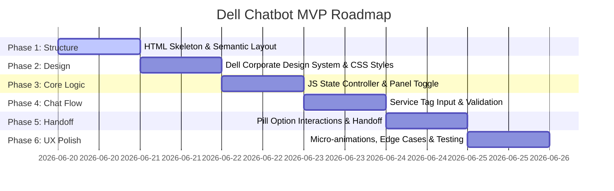

# Phasewise Implementation Plan - Dell Chatbot MVP

This document outlines the step-by-step development strategy for the **Dell Technical Support Portal & Virtual Assistant** prototype. The implementation is broken down into structured phases to ensure progressive enhancement, robust state management, and an exceptional user experience.

---

## 🛠️ Tech Stack & File Structure
To keep the prototype lightweight, highly responsive, and easy to run, we will use a vanilla web stack:
* **HTML5**: Semantic structure.
* **CSS3**: Premium custom styles with CSS variables, Flexbox/Grid, and smooth hardware-accelerated transitions.
* **Vanilla JavaScript**: State machine, dynamic rendering, and interaction logic.
* **Assets / Icons**: FontAwesome (via CDN) or inline custom SVG icons for high-resolution graphics.

### Proposed Directory Layout:
```text
DellChatbotMVP/
├── index.html                    # Application layout & semantic structure
├── style.css                     # Corporate tech design system & layouts
├── app.js                        # State machine, chat flow, & UI logic
├── problemstatement.txt          # Original source specifications
├── problemstatement.md           # Formatted problem statement (Markdown)
└── phasewiseimplementationplan.md # This document
```

---

## 📅 Implementation Phases



### 🧱 Phase 1: HTML Skeleton & Semantic Structure
**Goal**: Build a semantic and fully structured document base without styles.

* **1.1 HTML Document Setup**:
  * Set up standard boilerplate (`<!DOCTYPE html>`, `lang="en"`, UTF-8, responsive viewport).
  * Import Google Font (`Inter` or `Roboto` for clean tech styling).
  * Load Lucide or FontAwesome icon library CDN.
* **1.2 Main Layout Containers**:
  * `<header>`: Main navigation bar representing Dell Support Portal header.
  * `<main class="portal-container">`:
    * `<section class="support-options-section">`: Hosting the main support page content.
    * `<aside class="chat-assistant-panel" id="chatPanel" aria-hidden="true">`: Floating or slide-in container for the chatbot.
* **1.3 Support Option Cards (Main Section)**:
  * Section title and description.
  * Card elements with unique IDs for interactive binding:
    * Card 1 (Interactive): `virtual-chat-btn`
    * Card 2 (Static): WhatsApp link
    * Card 3 (Static): Telephone block
* **1.4 Chat Window Elements (Aside Panel)**:
  * Chat header with title, online status dot, and close button (`close-chat-btn`).
  * Scrollable message display log (`#chatLog`).
  * Dynamic prompt area (`#chatInputContainer`) hosting the input field and submit button.

---

### 🎨 Phase 2: Dell Corporate Design System & CSS Layouts
**Goal**: Establish a premium visual style with a cohesive color palette, modern typography, and layout flow.

* **2.1 CSS Custom Properties (Variables)**:
  * Define color tokens:
    * `--dell-blue`: `#0076CE` (Primary Dell Blue)
    * `--dell-blue-hover`: `#005C9E`
    * `--bg-light`: `#F9F9FB` (Dell support site background)
    * `--card-bg`: `#FFFFFF`
    * `--text-primary`: `#2D3138` (Slate dark gray for high readability)
    * `--text-secondary`: `#5E6675`
    * `--border-color`: `#E5E7EB`
    * `--chat-bot-bubble`: `#F1F3F5`
    * `--chat-user-bubble`: `#E1F0FF`
  * Typography, transitions, and shadow tokens.
* **2.2 CSS Reset & Base Styles**:
  * Set up standard box-sizing, smooth scrolling, and fonts.
* **2.3 Layout Styling (Flexbox & Grid)**:
  * Modern split grid or overlays to align options nicely.
  * Card components: Add slight border-radius (`8px`), clear padding, micro-animations on hover (scale up `1.02`, slight drop shadow glow).
* **2.4 Slide-in Chat Assistant Panel**:
  * Position it absolutely/fixed on the right side.
  * Style the toggle transition (e.g., standard state `transform: translateX(100%)` with transition `transform 0.3s cubic-bezier(0.16, 1, 0.3, 1)`).
  * Chat messages layout: Auto-scroll container, message bubbles styling with bubble tail shapes or clean rounded blocks.

---

### ⚙️ Phase 3: JS State Controller & Panel Toggle
**Goal**: Wire the toggle mechanisms and introduce the central state controller.

* **3.1 Central State Object in JS**:
  ```javascript
  const appState = {
    chatOpen: false,
    currentState: 'closed', // 'closed', 'greeting', 'tag_captured', 'option_selected'
    serviceTag: '',
    selectedTopic: ''
  };
  ```
* **3.2 Event Listeners**:
  * Event listener on `virtual-chat-btn` to call `openChat()`.
  * Event listener on `close-chat-btn` to call `closeChat()`.
* **3.3 Toggle UI Functions**:
  * Update visibility state classes (`.is-open`) on the chat panel.
  * Manage ARIA properties (`aria-hidden="false"`) for web accessibility.
  * Handle focus shifting when the chat panel slides in/out.

---

### 💬 Phase 4: Service Tag Capture & Bot Dialogues (State 1 & 2)
**Goal**: Build the first interactive conversation step.

* **4.1 Auto-Greeting Sequence**:
  * When `openChat()` is invoked, trigger the greeting message logic after a tiny natural delay (`400ms`).
  * Function `appendBotMessage(text)`: Creates a DOM element with bot-styled bubble, appends to `#chatLog`, and triggers an animation.
  * Dynamically create the service tag input card directly inside the chat log:
    * Text field (`placeholder="e.g., 4ABC123"`).
    * Validating submit button.
* **4.2 Service Tag Form Handler**:
  * Intercept form submit or keypress (Enter).
  * Validate service tag format:
    * Regex validation for standard Dell Service Tag format (7 alphanumeric characters) or general fallback input validation.
  * If invalid, show a temporary error message below input.
  * If valid, transition state:
    * Disable the form elements immediately.
    * Append user's input as a right-aligned message bubble: `appendUserMessage(tag)`.
    * Update state variables: `appState.serviceTag = inputVal; appState.currentState = 'tag_captured'`.

---

### 🎛️ Phase 5: Menu Option Pills & Selection Handoff (State 3 & 4)
**Goal**: Present the interactive decision pills and handle selections.

* **5.1 Render Option Pills**:
  * Immediately after the user submits the service tag, trigger `appendBotMessage("To help me guide you to the right solution, please select an option from the menu below:")`.
  * Create a container element `#optionsPillContainer` with five pill buttons:
    * `💻 Hardware & Performance Issues`
    * `💿 Software, OS, & Drivers`
    * `📋 Check Warranty Status`
    * `📦 Order & Dispatch Status`
    * `🧑‍💻 Connect to Live Agent`
  * Add exit animations to ensure elements enter smoothly.
* **5.2 Pill Click Interceptor**:
  * Attach click listeners to all buttons.
  * When clicked:
    * Mark selection: `appState.selectedTopic = topicLabel`.
    * Disable all pills (fade opacity and pointer-events) to freeze the interaction.
    * Append user message indicating selection.
    * Run action based on selection:
      * **Live Agent**: Show handoff loader ("Transferring you to a human agent... Please hold.").
      * **Warranty Status**: Simulate API check ("Verifying warranty details for Service Tag [Tag]... Current status: Active Premium Support until December 2026.").
      * **Other categories**: Standard helper prompt text or FAQs.

---

### 🎨 Phase 6: UX Polish, Edge Cases & Verification
**Goal**: Review animations, ensure resilience against edge cases, and run interactive verification checks.

* **6.1 Micro-interactions**:
  * Typing indicator animation (three jumping dots) before bot messages appear.
  * Scroll-to-bottom helper: Automatically scroll `#chatLog` down whenever new bubbles are rendered.
* **6.2 Responsive Design**:
  * Mobile view support: If screen size < 768px, slide the chat window to occupy 100% viewport width instead of a right panel overlay.
* **6.3 Code Quality & Cleanup**:
  * Refactor redundant DOM manipulations.
  * Ensure CSS is dry and properly structured.
  * Run validation tests locally to guarantee state stability (e.g. toggling open/close multiple times without reset issues).

---

## 📈 Verification Plan

### Automated Checks (Linting & Integrity)
* Run local static code structure check to confirm no broken links or missing tags.

### Manual UX Checklist
1. **Initial Load**: Check that the chat panel is fully hidden and no overlay interrupts the page.
2. **Launch Chat**: Clicking "Virtual Chat Session" opens the panel smoothly.
3. **Form Freeze**: Verify that hitting Enter or clicking Submit disables the input and adds a blue bubble to the right.
4. **State Persistence**: Verify options are clickable and clicking them disables other pills.
5. **Close/Reopen Flow**: Verify that closing the panel and reopening it resets the chat logic to allow a clean restart.
