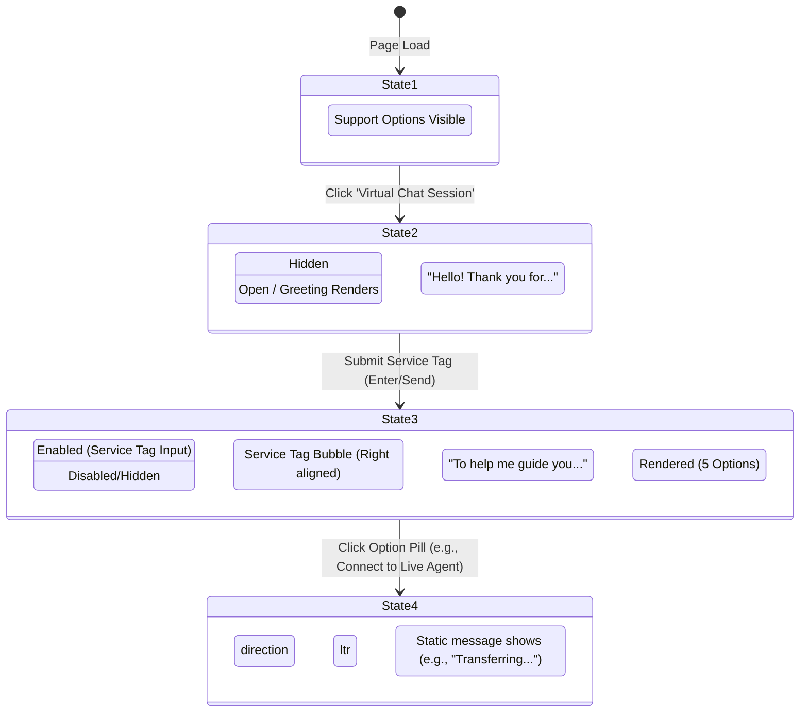

# Dell Technical Support Chatbot MVP - Problem Statement

This document details the requirements and layout specifications for building a single-page interactive prototype of a **Dell Technical Support Portal** featuring a floating virtual chat assistant.

---

## 🎯 Objective
Create a standard desktop web application representing a **Dell Support Page** that integrates an interactive chat assistant with step-by-step stateful user interactions. The application must look modern, professional, and feel responsive.

---

## 🖥️ Layout & Components

The interface consists of a desktop support landing page divided into two primary sections:

### 1. Main Support Page (Left/Center Panel)
* **Theme**: Clean corporate tech theme utilizing white backgrounds, light gray styling, and official Dell Blue accents.
* **Header**: `"Dell Technical Support — Contact Us"`
* **Support Options Card Container**: Hosts 3 vertical option blocks:
  1. **Virtual Chat Session**:
     * *Icon*: Chat icon.
     * *Interaction*: The primary interactive element. Clicking this opens the virtual chat window.
  2. **Connect via WhatsApp**:
     * *Icon*: WhatsApp icon.
     * *Interaction*: Static/non-functional link.
  3. **Call Technical Support**:
     * *Icon*: Telephone icon.
     * *Interaction*: Static text displaying a placeholder phone number (e.g., `1-800-879-3355`).

### 2. Chat Assistant Window (Right Panel)
* **Visibility**: Hidden by default. Slides open from the right side or floats in when the user clicks **Virtual Chat Session**.
* **Header**: "Dell Virtual Assistant" with a close button to toggle the window shut.
* **Chat History**: Display area showing message bubbles between the bot and the user.
* **Input Area**: Dynamically displayed input field for the user to provide their Service Tag.

---

## 🔄 State Machine & Interactive Behavior

The prototype implements a simple, state-driven workflow for user-bot interaction:

### State 1: Initial Page Load
* The main support page and card options are fully visible.
* The Chat Window on the right-hand side is **hidden** off-screen or faded out.
* **Trigger**: User clicks on the **Virtual Chat Session** option block.

### State 2: Chat Window Activation (Greeting)
* The Chat Window slides/transitions into view on the right.
* **Bot Message 1** renders automatically:
  > *"Hello! Thank you for contacting Dell Technical Support. I am your Dell Virtual Assistant. To get started, please enter your Service Tag or Express Service Code."*
* A text input field with placeholder `"e.g., 4ABC123"` and a send icon/button is displayed at the bottom of the chat window.
* **Trigger**: User enters any text (Service Tag) and presses **Enter** or clicks the **Send** button.

### State 3: Service Tag Captured & Menu Options
* The User's submitted Service Tag is rendered in the chat history as a user message bubble (aligned to the right).
* The text input field and submit button disappear or become disabled to freeze the answer.
* **Bot Message 2** renders immediately:
  > *"To help me guide you to the right solution, please select an option from the menu below:"*
* **Interactive Pills**: Rendered directly underneath Bot Message 2 as 5 clickable shortcuts:
  1. 💻 Hardware & Performance Issues
  2. 💿 Software, OS, & Drivers
  3. 📋 Check Warranty Status
  4. 📦 Order & Dispatch Status
  5. 🧑‍💻 Connect to Live Agent
* **Trigger**: User clicks on any option pill.

### State 4: Option Selected & Resolution/Handoff
* A static confirmation or handoff message is rendered to reflect the selected option.
  * *Example (Connect to Live Agent)*: *"Transferring you to a human agent... Please hold."*
  * *Example (Check Warranty Status)*: *"Checking warranty details for Service Tag [Service Tag]... All clear."*

---

## 🎨 Visual & UX Guidelines

* **Color Palette**:
  * Primary Brand Color: Dell Blue (`#0076CE`) for headers, buttons, links, and active elements.
  * Backgrounds: Pure white (`#FFFFFF`) for main panels, light gray (`#F4F4F4`) for containers.
  * Text: Slate Gray / Dark Charcoal (`#333333` / `#4A4A4A`) for high contrast readability.
* **Chat Interface Styling**:
  * **Bot Messages**: Light gray background bubble, left-aligned, standard text.
  * **User Messages**: Dell Blue background bubble, white text, right-aligned.
  * **Transitions**: Smooth slide-in transition for the Chat Window and fade-in animations for chat bubbles.
* **Interactive Element Styling**:
  * Option blocks on the main support page should have scale/shadow hover transitions.
  * Pill buttons must have rounded corners, distinct borders, and hover background color changes to denote clickability.
