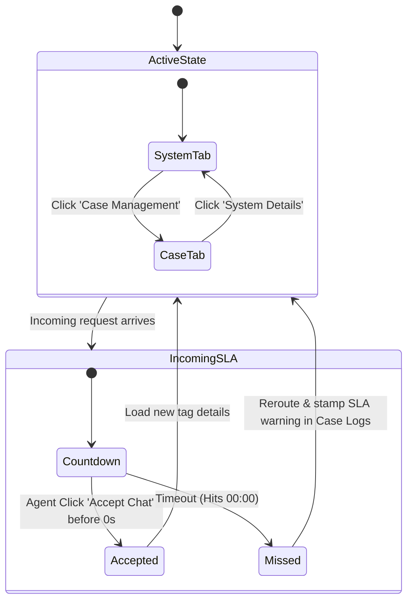

# Dell Salesforce Service Console (Out-of-Warranty Prototype) - Problem Statement

This document details the requirements and interactive specifications for building a prototype of a **Salesforce Service Console** optimized for Dell customer support agents handling exclusively **Out-of-Warranty (OOW)** systems.

---

## 🎯 Objective
Build a web-based interactive workspace representing a Salesforce Service Console split screen. The layout features layout controls, automated SLA chat countdowns with failure triggers, and dual-mode workspace tabs for agent logging and system diagnostics.

---

## 🖥️ Screen Layout & Screen Division

The interface replicates a modern Salesforce CRM console with a **1/3 to 2/3 split** layout.

```text
+----------------------------------------------------------------------------------------------------+
|                                    Header: Agent Console Info                                      |
+------------------------------------+---------------------------------------------------------------+
|                                    |  Right Panel: Dual-Mode Workspace (2/3 Width)                 |
| Left Panel: Chat Console (1/3)     |  +---------------------------------------------------------+  |
|                                    |  | Sub-Tab: [System Details]  |  Sub-Tab: [Case Management]|  |
| +--------------------------------+ |  +---------------------------------------------------------+  |
| | Navigation Tabs                | |  |                                                         |  |
| | [Active] [Incoming] [Ended]    | |  |  - Customer Profile (Name, Contact Details)             |  |
| +--------------------------------+ |  |  - Hardware Details (Inspiron 15, CPU, RAM, Asset Age)  |  |
| |                                | |  |  - Warranty Entitlement (🔴 OUT OF WARRANTY Badge)     |  |
| | Active Chat & Transcript Stream| |  |                                                         |  |
| |                                | |  |  - Activity Timeline & Case Logs (Mode B)               |  |
| |                                | |  |                                                         |  |
| +--------------------------------+ |  +---------------------------------------------------------+  |
+------------------------------------+---------------------------------------------------------------+
```

### A. Left Panel: Unified Chat Console (1/3 Screen Width)
* **Session Navigation Tabs**: A status-categorized tab bar at the top to toggle chat sessions:
  1. 🟢 **Active**: Labeled with the currently handled Service Tag (e.g., `Tag: 9XYZ789`). Selecting this loads the active conversation, customer CRM details, and logs.
  2. ⚠️ **Incoming**: A flashing alert tab labeled `New Request - Tag: 4ABC123` containing a live **30-second countdown timer** (e.g., `Accept within 00:24s`).
  3. 🚫 **Ended**: Muted tab representation of historical sessions (e.g., `Closed - Tag: 2LMN456`).
* **Active Chat Stream**: Displayed when the 🟢 Active tab is selected.
  * **Historical Bot Transcript**: Shows the customer's self-service routing path (Greeting $\rightarrow$ Service Tag entry $\rightarrow$ Live Agent handoff request).
  * **Automated Agent Greeting**:
    > *"Thank you for contacting Dell Technologies. My name is Arjun. I see you're reaching out about an issue with your system (Service Tag: {Service_Tag}). Let me review the details you provided, and I will help you resolve this right away. Meanwhile, please feel free to share any further details or specific error messages about the issue you are facing."*

### B. Right Panel: Dual-Mode CRM Workspace (2/3 Screen Width)
Features two sub-tabs at the top to toggle the panel's active content:

#### Mode Tab A: System Details (Default View)
* **Header Bar / Live Metrics**: Displays key KPIs:
  * Average Handle Time counter (e.g., `AHT: 03:45`).
  * Current Queue Volume (e.g., `📥 2 chats waiting`).
* **Component 1: Customer Profile Card**:
  * Contact info: Name, Mobile Number, Alternate Mobile Number (Optional), and Email Address.
* **Component 2: System & Hardware Details**:
  * Tech specifications: Model (e.g., `Inspiron 15`), CPU, RAM, Storage.
  * **Asset Age**: Strictly constrained mock data displaying ages under 4 years (e.g., `3 Years, 2 Months` or `2 Years, 11 Months`).
* **Component 3: Warranty & Entitlement Status**:
  * *Important Layout Design Constraint*: No global app headers should indicate that the page is Out-of-Warranty. Instead, the OOW status must be contained purely within the card component:
    * Status Badge: 🔴 **OUT OF WARRANTY**
    * Historical Log: `Previous Plan: ProSupport Plus | Expired: 6 Months Ago`

#### Mode Tab B: Case Management & Logs
* **Case Details**:
  * Core fields: Case ID, Creation Date, Origin (`Chat`), and Current Status (`Open`).
* **Interactive Case Logs**:
  * A vertical activities timeline hosting manual agent notes and automatic system stamps generated during the lifecycle of the active chat.

---

## 🔄 Interactive Behavior & State Machine



### State 1: Active Chat & Workspace Toggling
* The agent views the 🟢 **Active** tab.
* **Trigger**: Agent clicks between the **System Details** sub-tab and the **Case Management** sub-tab in the right panel.
* **Action**: The workspace switches views seamlessly to show either the diagnostic/warranty card or the timeline logs.

### State 2: Accepting the Incoming Request (Interactive SLA)
* While the agent is working on the Active session, the ⚠️ **Incoming** tab flashes with a ticking 30-second countdown.
* **Trigger**: Agent clicks the ⚠️ **Incoming** tab or clicks its native **Accept Chat** button before the timer hits `00:00`.
* **Action**:
  * The Incoming tab changes status indicator to 🟢 **Active**.
  * The countdown timer clears.
  * The automated greeting is appended to the chat.
  * The CRM details in the right-side workspace update to reflect the newly accepted asset (e.g., `Asset Age: 1 Year, 8 Months; Warranty: 🔴 Out of Warranty`).

### State 3: Missed Request & Automated Case Logging (Timer Timeout)
* **Trigger**: The 30-second countdown timer on the incoming request hits `00:00` without being accepted.
* **Action**:
  * The incoming session tab closes and is marked as rerouted.
  * The system automatically generates a background error event.
  * If the agent views the Case Management logs for that routing instance, a red-flagged system entry is appended:
    > `[SYSTEM ALERT - 01:08 AM]: Chat request route timed out. Agent failed to accept session within 30-second SLA limit. Session rerouted to queue.`

---

## 🎨 Visual & UX Guidelines

* **Asset Consistency**: Make sure all simulated asset age properties displayed across active, incoming, or ended tabs are between **1.0 and 3.9 years** to fit the target Out-of-Warranty cohort profile.
* **Granular Warranty Indicators**: Maintain Salesforce realism. Do not style global warning banners; instead, isolate the 🔴 **OUT OF WARRANTY** badge strictly inside the individual warranty component card boxes.
